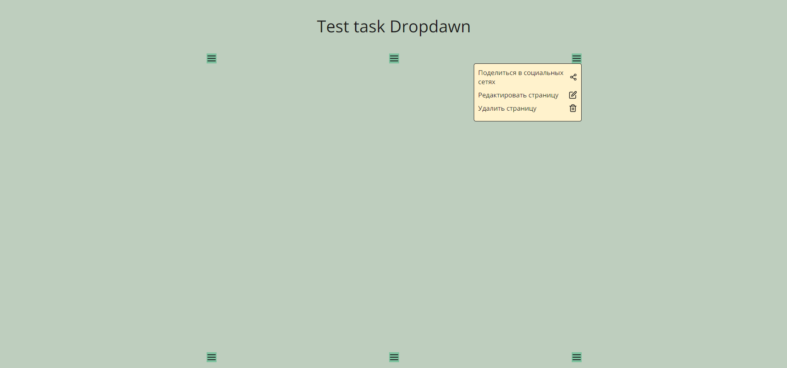

# Тестовое задание "test-task-dropdawn"

## Задание
 

Описание

С помощью TypeScript и библиотеки React (Next, CRA, Vite - по вашему желанию, что больше нравится) реализуйте компонент DropdownMenu. Используйте только функциональные компоненты. В проекте настройте code и style линтинг с помощью eslint и prettier.

Контент должен задаваться снаружи компонента.

DropdownMenu должен уметь автоматически определять сторону открытия контента и раскрывать его по клику в ту сторону, где будет больше места относительно триггера.

Допустимые позиции: 
- вниз-вправо,
- вверх-вправо,
- вниз-влево,
- вверх-влево.

Сделайте триггер изменяемым и представьте его любым элементом интерфейса. Клик снаружи или повторный клик в триггер должны закрывать активный дропдаун. Может быть только один активный дропдаун. Если открывается другой, текущий должен быть закрыт. Реализуйте на странице три дропдауна, чтобы можно было проверить все требования: слева, в центре и справа. 

Страница должна скроллиться по вертикали. Если при скролле страницы дропдауну не хватает места для отрисовки, то он должен перерисоваться в новое место так, чтобы контент отобразился корректно. При выходе инициирующего элемента из вьюпорта дропдаун скрывается, а при появлении — отображать снова.

Клик на пункт меню дропдауна должен вызывать соответствующий ему колбэк и после закрывать дропдаун. Результат работы колбека можно выводить в любое место на странице или в консоль, чтобы проверить его работу.

Ширина контента дропдауна должна быть ограничена 260 пикселями. Остальные стили контента на ваше усмотрение, но старайтесь сделать компонент таким, чтобы его можно было использовать в реальном проекте.

Для иконок (опционально) можно воспользоваться паком feather-icons. В конфиге TypeScript обязательно должен быть включен строгий режим проверки типов. В коде старайтесь избегать any, unknown и “!”.

Не используйте сторонние библиотеки, ограничьтесь React и react- dom.
*Задание со звёздочкой и является опциональным: покройте реализованный компонент тестами с помощью библиотеки Jest.

На макете показано как должен отрисовываться контент компонента в зависимости от свободного места. Стилизация и цветовая палитра остается на ваше усмотрение, это творческая работа, используйте чистый CSS в модулях. Общие стили допускается вынести в отдельный файл, который будет подключен на уровне приложения.

## Используемые технологии
* React
* React-dom
* TypeScript
* Next.js

## Результат

## Локальный запуск проекта:
* Выполните `npm install && npm next dev` в терминале, находясь в папке проекта.